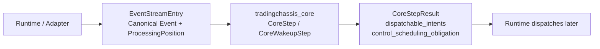

# TradingChassis Core

`tradingchassis_core` is a deterministic step engine for trading decisions.

It turns ordered canonical events into Core decisions/intents. It does not
perform venue I/O or external order dispatch.

## Core In One Picture



## Pipeline

```text
EventStreamEntry
  -> process_event_entry / process_canonical_event
  -> strategy evaluator
  -> generated intents
  -> candidate records
  -> dominance / reconciliation
  -> policy admission
  -> execution-control plan/apply
  -> CoreStepResult.dispatchable_intents
  -> Runtime dispatches later
```

## Input / Core / Output / Not Owned By Core

- **Input:** `EventStreamEntry` values with canonical events and stream position.
- **Core does:** deterministic reduction, strategy evaluation boundary, candidate
  merge/dominance, policy admission, execution-control planning/apply.
- **Output:** `CoreStepResult` with generated/candidate intents, optional
  `dispatchable_intents`, and optional `control_scheduling_obligation`.
- **Not owned by Core:** raw market/feed I/O, venue adapters, external dispatch,
  credentials/environment wiring, runtime orchestration, Kubernetes/deployment.

## Quickstart

Run the Core-only quickstart from `core`:

```bash
python examples/core_step_quickstart.py
```

Minimal shape:

```python
import tradingchassis_core as tc

state = tc.StrategyState(event_bus=tc.NullEventBus())
result = tc.run_core_step(
    state,
    tc.EventStreamEntry(
        position=tc.ProcessingPosition(index=0),
        event=tc.ControlTimeEvent(
            ts_ns_local_control=1_000,
            reason="scheduled_control_recheck",
            due_ts_ns_local=1_000,
            realized_ts_ns_local=1_000,
            obligation_reason="rate_limit",
            obligation_due_ts_ns_local=1_000,
            runtime_correlation=None,
        ),
    ),
)
print(result.generated_intents, result.dispatchable_intents)
```

See `examples/core_step_quickstart.py` for the full runnable walkthrough.

## Public Entrypoints

| Entrypoint | Purpose |
| --- | --- |
| `run_core_step` | One-entry deterministic reduce/evaluate/decide/apply step |
| `run_core_wakeup_reduction` | Multi-entry reduction phase for one wakeup |
| `run_core_wakeup_decision` | Wakeup-level candidate/policy/execution decision phase |
| `run_core_wakeup_step` | Convenience wrapper for reduction + decision |
| `process_event_entry` | Reduce one `EventStreamEntry` into `StrategyState` |
| `process_canonical_event` | Reduce one canonical event into `StrategyState` |

## Ownership Boundary

| Core owns | Runtime owns |
| --- | --- |
| canonical models/contracts | raw I/O and feed adapters |
| state reduction and ordering | venue adapters and transport |
| strategy evaluator boundary | external dispatch execution |
| candidate intents and reconciliation | credentials/env wiring |
| policy admission | live/backtest orchestration |
| execution control | Kubernetes/deployment |
| `CoreStepResult` decision contract | runtime lifecycle glue |

## Developer Commands

From the `core` directory:

```bash
python -m pip install -e ".[dev]"
python examples/core_step_quickstart.py
python -m pytest -q
python -m mypy tradingchassis_core tests
python -m build
```

## Docs

- `docs/README.md`
- `docs/reference/public-api.md`
- `docs/reference/events-reference.md`
- `docs/code-map/core-pipeline-map.md`
- `docs/code-map/repository-map.md`
- `docs/how-to/add-canonical-event.md`
- `docs/how-to/update-core-step-pipeline.md`
- `docs/how-to/update-policy-and-execution-control.md`

## Project References

- Changelog: `CHANGELOG.md`
- Contributing: `CONTRIBUTING.md`
- Security: `SECURITY.md`
