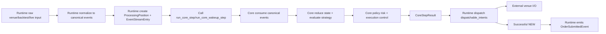

# Core and Runtime Responsibility Model

This is the target architecture model that current MVP paths are moving toward.

The diagram below shows the migrated-path ownership boundary at a glance. Runtime owns external
I/O and dispatch execution, while Core owns deterministic semantic reduction and decision shaping.

## Runtime owns

- Receiving raw venue/backtest/live inputs.
- Normalizing raw inputs into canonical Core events.
- Allocating `ProcessingPosition` and creating `EventStreamEntry`.
- Calling `CoreStep` / `CoreWakeupStep` APIs.
- Holding and realizing `ControlSchedulingObligation`.
- Injecting `ControlTimeEvent` when due.
- Dispatching only `CoreStepResult.dispatchable_intents` for migrated paths.
- Emitting `OrderSubmittedEvent` only after successful external `NEW` dispatch.
- Venue/runtime I/O and execution error observability.

## Core owns

- Consuming canonical events only.
- Deterministic state reduction.
- Strategy evaluation via the CoreStep evaluator path.
- Combining generated and queued intent candidates.
- Intent dominance/reconciliation.
- Policy-only risk decisions.
- Execution control decisions:
  - queue behavior
  - rate behavior
  - inflight/sendability behavior
  - scheduling obligation derivation
- Returning `CoreStepResult`.

## Runtime must not own (migrated paths)

- Productive strategy execution outside CoreStep.
- Productive runtime `risk.decide_intents` for migrated paths.
- Intent dominance decisions.
- Fachlich queue pop/merge business semantics.
- Venue-independent business semantics that belong to Core.
- GateDecision as final architecture.
