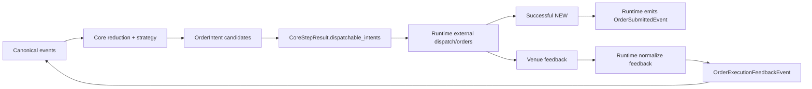

# Event Model (Current MVP)

## Canonical events today

- `MarketEvent` is canonical.
- `ControlTimeEvent` is canonical only after Runtime realizes a due
  `ControlSchedulingObligation` and injects the event.
- `OrderSubmittedEvent` is canonical and emitted by Runtime after successful
  external `NEW` dispatch.
- `OrderExecutionFeedbackEvent` is canonical MVP ingress event for normalized
  rc3 order/execution/account feedback.
- `FillEvent` is canonical in model terms, but is not used for snapshot-only rc3
  MVP ingress.

## Compatibility/non-canonical today

- `OrderStateEvent` remains compatibility/non-canonical.
- `ControlSchedulingObligation` is non-canonical output from Core.
- `GateDecision` is compatibility for legacy/default-off paths.

## Processing and ordering notes

- Runtime owns canonical event construction and injection timing.
- Canonical ingestion order is defined by runtime-assigned `ProcessingPosition`.
- Runtime dispatches `CoreStepResult.dispatchable_intents` for migrated paths.

The diagram below clarifies the event/intent/order boundary: Core works on canonical events and
intents, while Runtime handles external order dispatch and feedback normalization.

