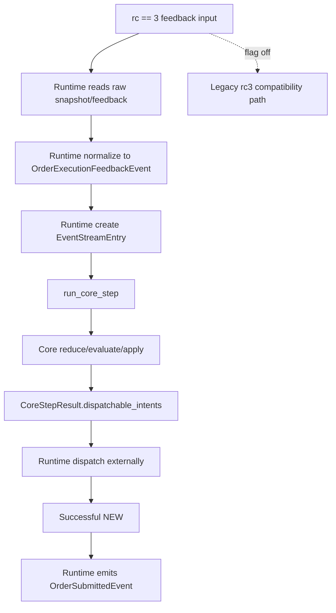

# OrderExecutionFeedbackEvent (rc3 MVP)

## Scope

This page describes the MVP rc3 feedback path, not a full lifecycle redesign.

The diagram below highlights the migrated rc3 flag-on flow and keeps legacy flag-off behavior as a
secondary compatibility branch.

## Current MVP flow (flag on)

- Runtime reads raw rc3 feedback/snapshot input as adapter input.
- Runtime normalizes that input into `OrderExecutionFeedbackEvent`.
- Runtime calls `run_core_step`.
- Core reduces the canonical feedback event and evaluates strategy through the
  CoreStep evaluator bridge.
- Runtime dispatches `CoreStepResult.dispatchable_intents`.

## Flag and compatibility behavior

- Migrated path flag:
  `enable_core_step_order_feedback_dispatch`.
- When flag is `false`, legacy rc3 path remains available.

## Explicit non-claims

- No full order lifecycle model is introduced by this MVP.
- Do not treat snapshot-only rc3 ingress as `FillEvent` ingress.
